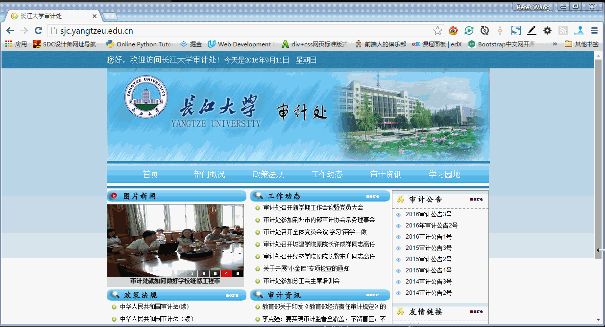
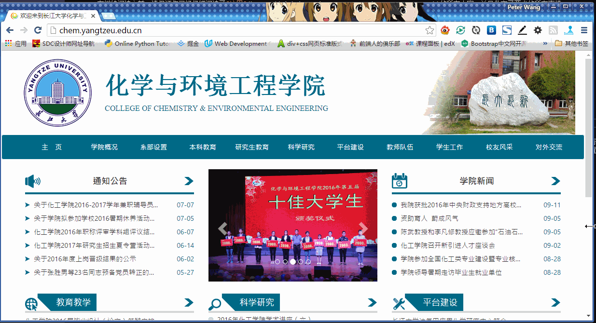

# 第二周任务

经历了第一周的热身任务之后，相信大家对于咱们日常工具使用的工具（包括编辑器， GitHub 和 Markdown）和咱们前端的三板斧（ HTML， CSS， JavaScript ）都已经有一定程度的熟悉了，至少完成简单的页面不会有太大问题。我说过，第二周我会带大家玩一点好玩的东西，现在我就来兑现诺言。

## 概述

咱们之前写的页面再电脑全屏上看也许是还不错，但是如果我们把“屏幕”宽度（这里用浏览器的宽度做演示）缩小，浏览起来就显得有些捉襟见肘了。

你看，屏幕宽度小于网页宽度的时候，我们就要不停地拖动页面才能完整浏览，好不尴尬。

你也许会说，现在电脑屏幕宽度都是 `1024px` 起步了。再说了，谁会这么无聊，把窗口缩那么小看？

但是，你有没有想过，如果你手上没有电脑，只有一部手机，而你又想在这个网页上面查找到你所需要的信息。手机的屏幕大小是极其有限的，你可以想象一下，如果你用手机来访问这个页面，那这样的用户体验会有多么糟糕。而且，现在手机和平板的性能越来越强大，以至于越来越多的人都开始摆脱对电脑的依赖，用这些设备来获取自己需要的信息。如果你的页面能够在这些设备上也能完美显示，那么无论是用户对于这个网站的好感，还是他们在这个网站上查询信息的效率，都会大大地提高。

那么真的有这样的办法吗？答案是肯定的。

你看，这样一个页面，无论我怎样更改这个页面的宽度，它总是会“聪明地”调整自己的布局来适应屏幕的宽度，行话叫做“自适应”布局。

没错，咱们第二周的任务，就是仿照[长江大学化学与环境工程学院](http://chem.yangtzeu.edu.cn/)，尝试自己写出这么一个自适应布局的网页！

## 具体要求

- 大体的要求跟第一周任务类似。
- 首先告诉大家一个好消息：这次我们终于有 PSD 用来切图啦！可以点击[这里](https://github.com/peterwang1996/YUOL-2015-FE-Task/blob/master/resourses/week2.psd)下载 PSD 。请注意，这次请大家把切过的 PSD 文件也放在项目文件夹里哟 ~
- 由于自适应也算是一个相对困难的工作，并且手机的情况比桌面浏览器的情况还要稍微复杂些，所以这次任务我允许大家使用第三方的 CSS / JavaScript 库，在我写化工院的时候用到了 [jQuery](http://jquery.com/) 这个 JavaScript 库和 [Bootstrap](http://getbootstrap.com/) 这个自适应的 UI 组件库。大家要是觉得其他的库用起来趁手而且能达到要求的话，也大可以拿来用。其实还是原来的套路，加了一点自适应的东西而已。
- 虽然有现成的库可以用，但我还是希望大家多多去了解关于自适应和响应式布局的一些相关的知识，了解了原理才能更好地驾驭工具嘛。
- 你们这次写出的网页不仅要在自己的 PC 浏览器上达到和第一周一样的要求（即在 IE8+ / Chrome / FireFox 上正常显示），并且要在浏览器上用开发者工具在几种常见的分辨率测试，还要能够在**你自己的手机上**（不是浏览器模拟的手机）的默认浏览器通过测试。如果学有余力，甚至可以自己尝试用诸如 [Genymotion](https://www.genymotion.com/) 之类的工具弄一个安卓虚拟机，然后装上各种手机浏览器进行测试。
- 如果你不想总是用数据线把工程传到自己手机上测试的话，在本机搭建一个简易的静态资源服务器是一个比较好的办法。我本人现在在用的是 [node-anywhere](https://www.npmjs.com/package/node-anywhere) ，一个基于 [Node.js](https://nodejs.org/en/) 的静态服务器工具（如果你们要下载 Node.js 的话，我建议你们下载 LTS 版）。参考资料里给你们提供了网上一份比较简单的教程。如果你们看了这些教程还是不能理解的话可以跟我反馈，我会再自己写一篇简单的教程来说明这个工具的用法。当然在本机搭建服务器的办法不止一种，后台也有很多种选择。如果你对 PHP 比较感兴趣，也可以向 PHP 组的同学请教，搭建一个 WAMP 环境也是极好的。
- 另外，对于 Bootstrap 这样的组件库，一个代码片段插件可以让你的工作事半功倍。在各大编辑器平台，你都应该能找到类似“ Bootstrap 3 Snippets ”这样的插件，试着在你自己的编辑器上安装并使用这样的插件。
- 由于这周的任务稍微有些困难，并且配置各种环境可能会耗费一些时间，大家如果一周时间做不完的话也不要紧，不要有太大的包袱，尽力去做就好。

## 参考资料

第一周参考资料仍然适用，下面是一些补充的资料

- [jQuery 在线手册](http://hemin.cn/jq/)（对初学者友好的jQuery手册）
- [Bootstrap 中文文档](http://v3.bootcss.com/)
- [自适应网页设计（Responsive Web Design）](http://www.ruanyifeng.com/blog/2012/05/responsive_web_design.html)（这里是阮一峰老师总结的一份对自适应/响应式布局的简要介绍）
- [响应式布局那些事 - 慕课网](http://www.imooc.com/course/programdetail/pid/22)（这里是慕课网出品的一系列 Bootstrap 教程，大家可以按需观看）
- [响应式网页设计简单入门 - 刘哇勇 - 博客园](http://www.cnblogs.com/Wayou/p/responsive_design_step_by_step.html)（这篇文章用一个实例大概地把常用的响应式技术给我们串讲了一遍，大家可以大概浏览一下，或者自己跟着他的示例来练手）
- [CSS媒体查询 - MDN](https://developer.mozilla.org/zh-CN/docs/Web/Guide/CSS/Media_queries)
- [nodejs学习—安装](https://segmentfault.com/a/1190000003946734)
- [nodejs学习（二）—anywhere搭建本地服务器](https://segmentfault.com/a/1190000003960609)

------

## 一点补充

话说你们的学长最近在检查作业的时候，发现一个很蛋疼的问题。

我每一次想检查你们作业的时候，总是要先把你们的仓库里最新的修改 `push` 回来看，虽然 GitHub 的效率显然比直接传 zip 压缩包不知道高到哪里去了，但是这样还是略显麻烦。

如果你们想体谅一下你们可怜的学长的话，可以试着去学一学 [GitHub Pages](https://pages.github.com/) 是怎么玩的，如果官方的英文页面你看不懂，我最开始给你们提供的 GitHub 教程里面也有关于这个功能的介绍。

简言之，就是 GitHub 给你提供一个静态服务器，你仓库里所有在 `gh-pages` 这个分支下面的文件都可以通过这个静态服务器进行访问。

如果你真的这么做了并且感觉不错，那我再在这里提一点小建议：鉴于我们本来就是搭建的 Web 站点，各位不妨只留下一个 `gh-pages` 分支作为主分支，这样无论我什么时候访问你们的 GitHub Pages ，也总是能够看到你们最新的页面，岂不美哉？
